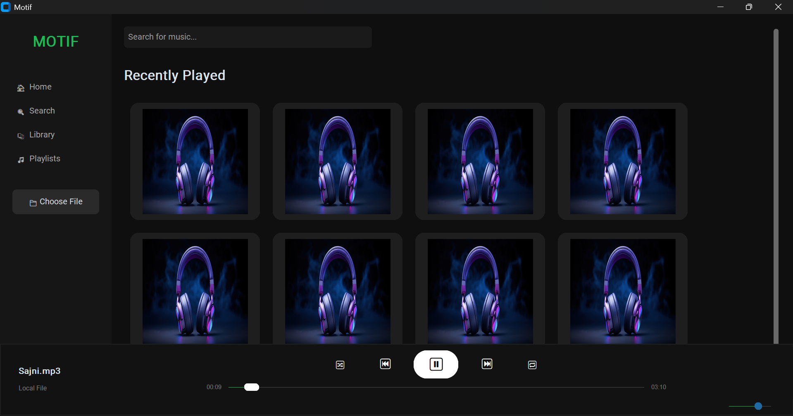

# 🎵 Motif – Modern Python Music Player

Motif is a modern desktop music player built using **Python, CustomTkinter, and Pygame**, featuring a sleek UI inspired by Spotify with smooth playback controls and real-time tracking.

---

## 📸 Screenshot

---

## 🚀 Features

- 🎧 Play / Pause / Resume music
- 📁 Load local MP3 files
- ⏱ Real-time progress tracking
- 🎚 Interactive seek bar (slider)
- 🔊 Volume control
- 🎨 Modern UI (CustomTkinter)
- 📂 Sidebar navigation (Home, Search, Library)
- 🎵 Dynamic song info display

---

## 🛠️ Tech Stack

- Python
- CustomTkinter
- Pygame (audio engine)
- Mutagen (metadata handling)
- PIL (image processing)
